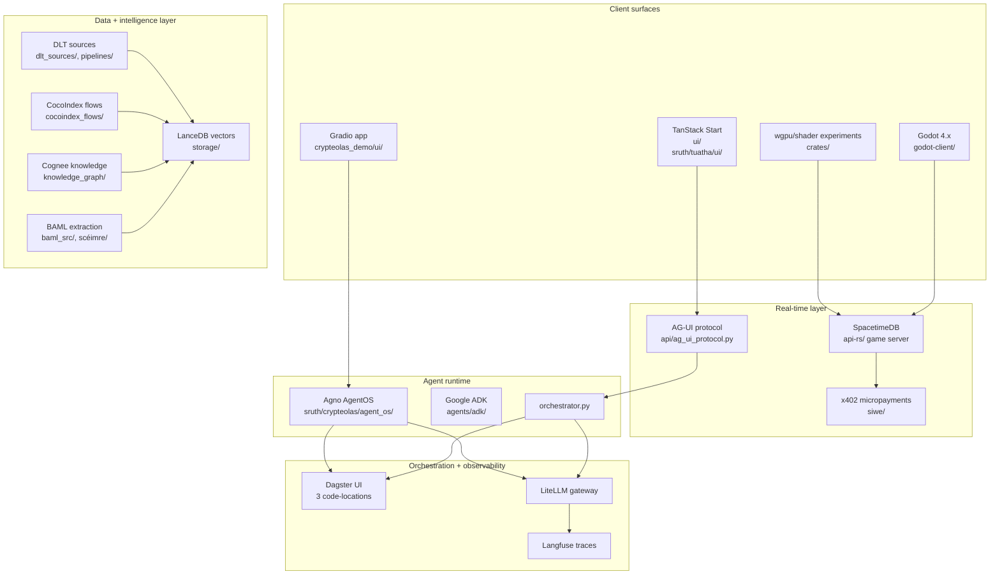

# Tuatha — The British Isles Formative Assessment MMO

*A British Isles educational MMO that delivers continuous formative feedback
(not summative) during quests, mapped to the NCCA / CfE / CfW / CCEA / SQA
curriculum frameworks. Babylon.js 3D game front-end, Rust + SpacetimeDB game
engine, TanStack Start web app, and the Crypteolas educational-achievement
ledger (skill-tree badges, not a financial token) — all consolidated into the
`tuath` uv workspace member.*

> **Phase 6 of the 6-phase refactor plan (2026-06-24):** the
> tuatha focus is now **British Isles formative assessment** (not
> "Celtic broadly"). The crypto is now **educational
> achievements** (skill-tree badges, not a financial token). The
> pedagogical framework is documented in
> [`.agents/skills/british-isles-formative-assessment/`](../.agents/skills/british-isles-formative-assessment/SKILL.md).

> See also: [`sruth/tuatha/AGENTS.md`](AGENTS.md) — the developer-quick-reference
> for the tuatha quadrant. The openspec spec is at
> [`openspec/specs/tuatha-platform/spec.md`](../openspec/specs/tuatha-platform/spec.md).

---

## Status (2026-06-15)

| Metric | Value |
|:--|:--|
| Workspace name | `tuath` (uv) — directory preserves the fada for tooling compatibility |
| Dagster code-location | Loads in **both** pytest and production as of 2026-06-15 (issue #18 closed). 23 assets wired. |
| DLT sources | `sruth/tuatha/dlt_sources/` has 7+ sources (geospatial gaeltacht_boundaries, leaving_cert, mythology, …) |
| Frontend / MMO | `sruth/tuatha/game/` (Babylon.js client), `sruth/tuatha/ui/`, `sruth/tuatha/wow/` (legacy MMO reference), `sruth/tuatha/fibo_generation/`, `sruth/tuatha/asset_generation/` |
| Crypto / SIWE | `siwe`, `eth-account`, `web3` declared in `pyproject.toml`; x402 micropayments referenced in `sruth/tuatha/crypteolas/` |
| Rust crates | `sruth/tuatha/crates/{services, solana, stdb-modules, wgpu}` |
| Container coupling | `sruth/tuatha/crypteolas/` + `sruth/tuatha/crypteolas_demo` + `sruth/tuatha/codeolas` registered in root `dg.toml`; Komodo stack at `infrastructure/komodo/stacks/croilar-bunchloch.toml` orchestrates the persona apps |

Full audit artifacts (deferred):

- `infrastructure/audit/scripts/inventory-bunchloch.sh` (live container state)
- `infrastructure/deploy-runbooks/tuatha.md` (not yet run; out of scope for the user-named 9)

## Known issues (2026-06-15)

| # | Issue | Tracked in | Severity |
|--:|:--|:--|:--|
| 1 | **RESOLVED 2026-06-15.** The `sruth.shared.http` import that broke the dagster code-location (per issue #18) is now shimmed at `sruth/tuatha/dlt_sources/geospatial/_sruth_shim.py`. The shim tries the real `sruth.shared.http` first (in case a future commit installs the sruth package); falls back to a local stub that returns empty responses. The 3 geospatial DLT source modules now import from the shim instead of from sruth. The dagster code-location loads in production with 23 assets wired. | GitHub issue #18 | **closed** |
| 2 | `sruth/tuatha/dlt_utils/destinations.py` is a defensive shim that re-exports oideachais' namespaced destinations (Phase 2.3 of `lateralise-british-isles-domains`). It falls back to a local copy of the pre-Phase-2.3 implementation if `oideachais` is not on sys.path. Works in pytest (the oideachais workspace member is installed); behaviour in production is the local fallback. The local-fallback code is duplicated and should be deleted once oideachais is a declared workspace dep. | `sruth/tuatha/dlt_utils/destinations.py` (75 lines, ~30 of which are the local fallback) | medium — works, but adds maintenance |
| 3 | **RESOLVED 2026-06-26 (Round 11 Phase 11 / tuatha audit Phase 3).** Pre-existing packaging issue: `sruth/tuatha/__init__.py` did not exist, and `sruth/tuatha/pyproject.toml` declared only sub-packages (`dlt_sources`, `dagster_assets`, etc.) under `[tool.hatch.build.targets.wheel].packages`. The `tuatha` package itself was not importable (`ModuleNotFoundError: No module named 'tuatha'`). `sruth/tuatha/tests/conftest.py:8: from tuath.api.main import app` failed (note: wrong import name `tuath` instead of `tuatha`). Workaround was `pytest --noconftest`. Fix mirrors issue #17 (commit `e9e0fc7d2` croilar packaging fix) — 4 components: (a) created `sruth/tuatha/__init__.py` (14-line canonical package marker); (b) changed `[tool.hatch.build.targets.wheel].packages` to `packages = ["."]` (hatch auto-detects sub-packages with `__init__.py`); (c) created `sruth/tuatha/scripts/fix-pth.sh` post-install script that rewrites the broken uv-generated `.pth` to contain `sruth/` (parent of `tuatha/`) so `import tuatha` works; (d) fixed 3 test files that used the wrong import name `tuath` (no 'a') — `tests/conftest.py:8`, `tests/test_graphiti_integration.py:8`, `tests/test_hybrid_search.py:8`. Verified post-state: `import tuatha` + `from tuatha.api.main import app` + `from tuatha.cocoindex_flows.transforms.celtic_multilingual import detect_celtic_language` all succeed. The `pytest --noconftest` workaround is no longer needed. The mise.toml post-install hook to auto-run `fix-pth.sh` after every `uv sync` is deferred to a future change. | Round 11 Phase 11 (`tuatha-audit-phase-3-fix-tuatha-packaging`) | **closed** |
| 4 | MMO / Babylon.js side (`sruth/tuatha/game/`, `sruth/tuatha/ui/`) is reference-quality — no live container or Komodo stack for the game client. Operates as a build target, not a deploy target. | `sruth/tuatha/game/` has no matching `infrastructure/stacks/tuatha-game/` | low — by design (out of the 9 user-named stacks) |
| 5 | **RESOLVED 2026-06-26 (Round 11 Phase 9 / tuatha audit Phase 1).** `sruth/tuatha/storage/serial_executor.py` (32 lines) was a broken re-export shim that imported `SerialDatabaseExecutor` + `get_executor` + `run_serial` from the **deleted** `sruth.shared.storage` package (deleted in commit `8484a6353`). The broken shim made `sruth.tuatha.storage` unimportable (`ModuleNotFoundError: No module named 'sruth.shared'`). Deleted the broken shim + rewired `sruth/tuatha/storage/__init__.py` to re-export the same 3 names directly from the canonical home `sruth.oideachais.core.storage.serial_executor` (the same pattern used by `sruth/tuatha/agents/tools/__init__.py` and the 4 spec-mandated `sruth/tuatha/agents/adk/*.py` thin re-exports). Verified: `sruth.tuatha.storage` is now importable for the first time since commit `8484a6353`. | Round 11 Phase 9 (`tuatha-audit-phase-1-delete-broken-storage-shim`) | **closed** |
| 6 | **RESOLVED 2026-06-26 (Round 11 Phase 10 / tuatha audit Phase 2).** `sruth/tuatha/dlt_sources/leaving_cert/__init__.py` (97 lines) violated the canonical tuatha DLT convention by defining 1 `@dlt.source` + 3 `@dlt.resource` + 1 helper function **inside** the package's `__init__.py`. The other 4 tuatha DLT packages (`mythology/celtic_mythology.py`, `geospatial/{gaeltacht_boundaries,gaelic_communities,welsh_language_areas}.py`) all follow the correct convention: `__init__.py` is a thin re-export shim, the sibling `.py` file contains the actual source code. Same anti-pattern fixed in oideachais Round 11 Phase 3D (16 multi-source files split). Moved the 97 lines verbatim to a new sibling file `dlt_sources/leaving_cert/leaving_cert.py` + rewrote `__init__.py` to a 5-line re-export shim (matching `mythology/__init__.py` pattern). Side cleanup: removed the dead `from dlt.sources.helpers import requests` import (no callers in the module). Active importer `sruth/tuatha/dagster_assets/exam_analysis.py:22` continues to work via the re-export shim. | Round 11 Phase 10 (`tuatha-audit-phase-2-split-leaving-cert-source-in-init`) | **closed** |
| 7 | **RESOLVED 2026-06-26 (Round 11 Phase 11 / tuatha audit Phase 3).** 3 of the 12 sub-packages listed in `pyproject.toml` `[tool.hatch.build.targets.wheel].packages` were missing their `__init__.py`: `api/`, `agents/`, `cocoindex_flows/`. They worked as PEP 420 namespace packages by accident, but PEP 420 namespace packages cannot contain sub-packages — `cocoindex_flows/transforms/celtic_multilingual.py` was unimportable (`ModuleNotFoundError: No module named 'cocoindex_flows.transforms.celtic_multilingual'`). Fix: created empty `__init__.py` for `sruth/tuatha/api/` + `sruth/tuatha/agents/` + `sruth/tuatha/cocoindex_flows/` + `sruth/tuatha/cocoindex_flows/transforms/`. Verified post-state: `from tuatha.cocoindex_flows.transforms.celtic_multilingual import detect_celtic_language` succeeds (canonical import via the `tuatha.` prefix now that `tuatha` is a real package; the bare `cocoindex_flows.transforms.X` form would resolve to the oideachais tree when `sruth/oideachais` is on sys.path). The other 9 sub-packages (`dlt_sources`, `dagster_assets`, `knowledge_graph`, `storage`, `asset_generation`, `dlt_utils`, `fibo_generation`, `demo`, `tests`) already had `__init__.py`. Part of the same Round 11 Phase 11 change as the umbrella packaging fix above. | Round 11 Phase 11 (`tuatha-audit-phase-3-fix-tuatha-packaging`) | **closed** |

## What This Is

The `sruth/tuatha/` sub-package is the Celtic Educational MMO half of the Cianfhoghlaim
monorepo, plus three consolidated Python/TypeScript platforms that were
previously scattered at the repo root. Every sub-package lives inside the single
`tuath` uv workspace member and shares one `uv.lock`, one Dagster code-location
dispatcher, and one LiteLLM gateway.

Four cooperating streams:

| Stream | What it does | Stack |
|:--|:--|:--|
| **Celtic Educational MMO** (`agents/`, `api/`, `api-rs/`, `baml_src/`, `cocoindex_flows/`, `dagster_assets/`, `dlt_sources/`, `dlt_utils/`, `fibo_generation/`, `game/`, `knowledge_graph/`, `storage/`, `ui/`, `crates/`, `notebooks/`) | Curriculum + mythology + asset generation + Babylon.js game client + Rust+SpacetimeDB backend + the dagster code-location for the Celtic MMO | Babylon.js + Vinxi + Dagster + DLT + BAML + SpacetimeDB + x402 + CopilotKit |
| **codeolas** (`sruth/tuatha/codeolas/`) | Publishable code-analysis library: semantic search over a Python codebase, knowledge graph of AST relationships, `.arch.md` generation, MCP server for Claude Code integration, Dagster assets for code indexing | LanceDB + tree-sitter + BGE-M3 + Dagster + MCP + langfuse + ddtrace |
| **crypteolas** (`sruth/tuatha/crypteolas/`) | GitHub data ingestion (issues, PRs, commits, workflows), DeFi protocol research (TVL, funding rates, yields), knowledge graph construction (Cognee + Graphiti + Memgraph + FalkorDB), interactive marimo notebooks, AgentOS + FastAPI | DLT + CocoIndex + Cognee + Graphiti + Memgraph + FalkorDB + FastAPI + AgentOS + marimo |
| **apps/crypteolas_demo** (`sruth/tuatha/apps/crypteolas_demo/`) | Standalone demo app: TanStack Start frontend (DeFi analytics + AI chat + x402 payments), Agno-based crypto agent team, MCP server for crypto analytics, Gradio UI for FIBO/EduVision curriculum, BAML schemas, Foundry Solidity contracts | TanStack Start + Bun + Agno + Gradio + BAML + Foundry + LiteLLM |

The **3-way interaction** that ties them together:

```
┌─────────────────────┐    ┌──────────────────────┐    ┌──────────────────────┐
│  sruth/codeolas/          │    │  sruth/crypteolas/        │    │  apps/crypteolas    │
│  ─────────────      │    │  ─────────────────   │    │  demo/              │
│  CodebaseAnalyzer   │◀──▶│  defs = Definitions  │◀──▶│  CryptoResearchAgent│
│  Code chunks        │    │  assets[]:           │    │  MCP tools          │
│  Knowledge graph    │    │   - github_api_*     │    │  TanStack Start     │
│  MCP server         │    │   - defi_*           │    │  (stubs)            │
│  Dagster assets     │    │   - crypto_knowledge │    │  Gradio FIBO UI     │
│  .arch.md gen       │    │  cocoindex_flows/    │    │  Anam Cara DAO      │
│                     │    │  marimo notebooks    │    │  FIBO image gen     │
└─────────────────────┘    └──────────────────────┘    └──────────────────────┘
            │                        │                          │
            └────────────┬───────────┴────────────┬─────────────┘
                         │                        │
                         ▼                        ▼
              ┌──────────────────────────────────────────────────┐
              │  Dagster code-location dispatcher (sruth/tuatha/dg.toml)│
              │  - location: tuath                                │
              │  - location: crypteolas                          │
              │  - location: crypteolas_demo                      │
              │  → one UI at http://localhost:3000                │
              └──────────────────────────────────────────────────┘
                                   │
                                   ▼  (all sub-packages)
              ┌──────────────────────────────────────────────────┐
              │  Celtic Educational MMO core                      │
              │  agents/ api/ api-rs/ dagster_assets/ baml_src/    │
              │  dlt_sources/ cocoindex_flows/ storage/ ui/       │
              │  game/ fibo_generation/ crates/ knowledge_graph/  │
              └──────────────────────────────────────────────────┘
```

- `sruth/codeolas/` is the **code-intelligence backbone** — it indexes the rest of the
  monorepo, surfaces semantic search results through the MCP server, and feeds
  the `.arch.md` docs that the other agents read.
- `sruth/crypteolas/` is the **data-intelligence backbone** — it ingests the external
  world (GitHub repos, DeFiLlama, CoinGecko, Binance, Aave/Pendle subgraphs)
  and surfaces the unified Defi+GitHub knowledge graph to the crypteolas
  agents and the marimo notebooks.
- `apps/crypteolas_demo/` is the **user-facing shell** that exposes the
  crypteolas data through a TanStack Start dashboard, an Agno multi-agent
  chat, and a Gradio FIBO curriculum-to-asset app. The TanStack frontend is
  currently a buildable shell of stubs (see `sruth/tuatha/apps/crypteolas_demo/STATUS.md`).
- All four streams route through the same `tuath` Dagster code-location
  dispatcher so the three code-locations appear in a single UI.

---

## Quickstart

```bash
# 0. One-time: install toolchain + hydrate Infisical vault
cd /Users/cianmacandeisigh/dev/kings_college_galway
bun run setup

# 1. Sync the tuath workspace member (resolves all 4 sub-packages)
cd tuatha && uv sync

# 2. Launch the unified Dagster UI (loads all 3 code-locations)
cd tuatha && uv run dagster dev
# → http://localhost:3000
# → Code locations: tuath, crypteolas, crypteolas_demo

# 3. Run the Celtic MMO API
cd tuatha && uv run uvicorn api.main:app --reload --port 8000

# 4. Run the crypteolas FastAPI backend
cd tuatha && uv run uvicorn crypteolas.api.main:app --port 8001

# 5. Run the crypteolas AgentOS runtime
cd tuatha && uv run uvicorn crypteolas.agent_os.main:app --port 7771

# 6. Start the crypteolas demo frontend (TanStack Start stub)
cd sruth/tuatha/apps/crypteolas_demo && bun install && bun run dev
# → http://localhost:3000 (proxies /api → localhost:8001)

# 7. Start the crypteolas demo Gradio UI (FIBO image gen)
cd sruth/tuatha/apps/crypteolas_demo && uv run python -m ui.app

# 8. CLI: try the códeolas code-analysis CLI
cd tuatha && uv run codeolas --help
cd tuatha && uv run codeolas search "auth" --limit 5

# 9. CLI: start the códeolas MCP server (stdio)
cd tuatha && uv run codeolas-mcp

# 10. CLI: start the crypteolas MCP server (stdio)
cd tuatha && uv run python -m crypteolas.mcp_server

# 11. Run the códeolas test suite
cd tuatha && uv run pytest sruth/codeolas/tests/ -v

# 12. Run the crypteolas test suite
cd tuatha && uv run pytest sruth/crypteolas/tests/ -v
```

The first time you boot the crypteolas backend, the `.env` will hydrate the
Locket-managed secrets (LiteLLM master key, Dagster home, MotherDuck token,
Garage S3 credentials, Infisical project ID) via the mise directory hook — no
manual `.env` editing required.

---

## The Dagster Code-Location Dispatcher

Three code-locations are registered in a single Dagster UI, all loaded by
the `tuath` workspace member.

| Code-location | Entry module | Asset count (approx) |
|:--|:--|:-:|
| `tuath` (Celtic MMO) | `dagster_assets.definitions` | ~13 (curriculum, mythology, embeddings, exam analysis) |
| `crypteolas` (GitHub + DeFi) | `crypteolas.definitions` | ~15 (github_api, defi, indexing, knowledge graph) |
| `crypteolas_demo` (FIBO + crypto) | `definitions` (in `apps/crypteolas_demo/`) | ~12 (FIBO image gen, crypto pipelines) |

**Launch options:**

```bash
# All three together (recommended) — workspace-level
cd tuatha && uv run dagster dev

# Just the Celtic MMO
cd tuatha && uv run dagster dev -m dagster_assets.definitions

# Just crypteolas
cd tuatha && uv run dagster dev -m crypteolas.definitions

# Just the crypteolas demo
cd sruth/tuatha/apps/crypteolas_demo && uv run dagster dev -m definitions

# Via mise aliases
mise dagster:tuath              # Celtic MMO only
mise dagster:crypteolas         # crypteolas only
mise dagster:crypteolas_demo    # demo only
```

The Dagster workspace is configured at the repo root in `dg.toml`, which
loads `sruth/oideachais/`, `sruth/tuatha/`, `sruth/tuatha/crypteolas/`, and
`sruth/tuatha/apps/crypteolas_demo/` as four projects.

### Códeolas Dagster assets (tuath location)

The códeolas Dagster assets live at `sruth/tuatha/codeolas/dagster_assets/` and
register:

- `code_chunks` — Tree-sitter AST-aware code chunking → LanceDB
- `code_graph` — Knowledge graph construction (Memgraph)
- `architecture_docs` — `.arch.md` generation from the chunked codebase

Launch with `cd tuatha && uv run dagster dev -m codeolas.dagster_assets.definitions`.

### Crypteolas Dagster assets (crypteolas location)

Two parallel pipelines, registered in `sruth/tuatha/crypteolas/definitions.py`:

| Pipeline | Source | Destination |
|:--|:--|:--|
| Ingestion | GitHub REST API (issues, PRs, commits, workflows), repo clone, Firecrawl, local files | DuckDB / DuckLake (Garage S3) |
| Indexing | LanceDB code vectors, LanceDB doc vectors, Memgraph doc graph, Cognee knowledge graph, Graphiti temporal graph | LanceDB + Memgraph + Memgraph + Cognee + FalkorDB |

### Crypteolas-demo Dagster assets (FIBO + crypto)

Two parallel pipelines, registered in
`sruth/tuatha/apps/crypteolas_demo/definitions.py`:

- `defs/curriculum/` — NCCA/SQA/WJEC curriculum → ColPali → Qwen3-VL → FIBO → image gen
- `defs/fibo_generation/` — visualizable_concepts → fibo_json_configs → generated_images
- `defs/blockchain/` — Web3/XP/NFT event-streaming (mock data)
- `pipelines/defs/` — full crypteolas crypto data pipeline (CoinGecko, DeFiLlama,
  Binance, Aave/Pendle subgraphs, Firecrawl scraping, CocoIndex + Cognee
  processing)

---

## codeolas — Code Analysis Library

A publishable Python library for semantic code search, knowledge graph
construction, and documentation generation. Formerly at
`códeolas_codebase_indexing/`, now consolidated at `sruth/tuatha/codeolas/`.

### Public API (lazy)

```python
from codeolas import (
    CodebaseAnalyzer, Config, get_config,
    chunk_code_file, detect_language, get_supported_languages,
    LanceCatalog, LanceCatalogConfig, get_lance_catalog,
    ArchGenerator, generate_arch_docs, ChangelogGenerator,
    multihop_search, expand_semantic_neighborhood, rerank_results,
    GraphBuilder, GraphQueries,
    MCPServer, main,
)
```

The high-level `CodebaseAnalyzer` and friends are lazy — importing
`codeolas` does not load `sentence-transformers` or `lancedb` until you
actually call into them.

### Module map

| Sub-package | What it does |
|:--|:--|
| `chunking/` | Tree-sitter AST-aware code chunking (29 languages, cAST algorithm) |
| `core/` | `CodebaseAnalyzer`, config, embedding service, entity extraction, observability |
| `storage/` | `LanceCatalog` (LanceDB-backed vector store with HNSW + MVCC) |
| `search/` | Multi-hop semantic search + reranking (Jina / Cohere / Aliyun) |
| `graph/` | Knowledge graph builder + Cypher query helpers |
| `generators/` | `.arch.md` + changelog generation (changelog is a stub; see STATUS.md) |
| `mcp_server/` | JSON-RPC MCP server with typed `Tool` dataclass registry |
| `dagster_assets/` | Dagster code-location for `codeolas` |
| `cocoindex_flows/` | CocoIndex flow for repo embedding |
| `tests/` | 35 unit tests + 31 integration tests |

### CLI

```bash
cd tuatha
uv run codeolas --help
uv run codeolas index --repo /path/to/repo
uv run codeolas search "auth" --limit 10
uv run codeolas research "How does the auth system work?"
uv run codeolas arch --output ARCHITECTURE.md
uv run codeolas-mcp  # stdio MCP server
```

### What was dropped during the consolidation

| Dropped | Kept | Why |
|:--|:--|:--|
| `generators/arch_generator.py` | `generators/arch.py` | Verbatim duplicate |
| `storage/lance.py` | `storage/lance_catalog.py` | The latter has the `EmbeddingModel` enum + dataclass-aware formatting |
| `flows/` (whole dir) | `cocoindex_flows/` | The latter is the registered CocoIndex flow variant |
| `pipelines/` (whole dir) | `dagster_assets/` | The latter imports from the canonical `cocoindex_flows` |
| `mcp/` (whole dir) | `mcp_server/` | The latter has the typed `Tool` dataclass registry |
| `agents/` (whole dir) | — | All stubs raising `NotImplementedError` |

See `sruth/tuatha/codeolas/STATUS.md` for the full dedup + shim history.

---

## crypteolas — Crypto Data Intelligence Platform

A Python data-intelligence platform for GitHub ingestion (issues, PRs, commits,
workflows), DeFi protocol research (TVL, funding rates, yields), semantic
code search, knowledge graph construction (Cognee + Graphiti + Memgraph +
FalkorDB), and interactive analysis (marimo notebooks). Formerly at
`crypteolas_formative_assessment/`, now consolidated at `sruth/tuatha/crypteolas/`.

### Public API

```python
from crypteolas.definitions import defs              # Dagster code-location
from crypteolas.api.main import app                  # FastAPI backend (port 8001)
from crypteolas.mcp_server import MCPServer          # stdio MCP server
from crypteolas.cocoindex_flows import unified_search, code_search
from crypteolas.agent_os.main import agent_os        # AgentOS runtime (port 7771)
from crypteolas.dlt_sources import (
    coingecko_source, defillama_source, binance_source,
    aave_subgraph_source, pendle_subgraph_source,
)
from crypteolas.knowledge_graph.cognee.static_knowledge import (
    setup_cognee, add_protocol_knowledge, search_knowledge,
)
from crypteolas.knowledge_graph.graphiti.temporal_graph import (
    get_graphiti_client, add_protocol_episode, query_protocol_timeline,
)
```

### Module map

| Sub-package | What it does |
|:--|:--|
| `api/` | FastAPI backend with routes for agent, analytics, github, payments, search |
| `agents/` | ADK + Agno + HITL + MCP server implementations |
| `agent_os/` | AgentOS production runtime (TinyAuth + A2A + x402 middleware) |
| `baml_src/` | 6 BAML schemas (code_analysis, code_pattern_detection, crypto_extraction, protocol_analysis, vulnerability_assessment, clients) with `Crypteolas`-prefixed client names |
| `cocoindex_flows/` | Unified embedding + live docs + protocol graph (lazy-attribute public API) |
| `dagster_assets/` | Newer pipeline (github + defi + embedding + lakekeeper examples) |
| `dlt_sources/` | DLT sources for defi, documentation, github, local files |
| `dlt_utils/` | `NAMESPACE = "crypteolas"` DuckLake destination factory |
| `graphiti/` + `knowledge_graph/` | Knowledge graph clients (Cognee static + Graphiti temporal) |
| `mcp_server/` | stdio MCP server with `TOOL_REGISTRY` + 8 tool implementations |
| `notebooks/` | 4 marimo notebooks (post-dedup) |
| `pipelines/` | Older Dagster pipelines + indexers + knowledge + scrapers + sources + transformations + shared |
| `storage/` | Storage clients (LanceCatalog, Garage, DuckLake, Lakekeeper) |
| `tests/` | 61 unit tests + 38 integration tests |
| `transformations/` | Ibis-based DeFi analytics |
| `ui/` | TanStack Start frontend (deferred to `apps/crypteolas_demo/`) |
| `_shims/` | Compatibility shims for the legacy `sruth.shared.*` imports |
| `docs/` | 7 historical design docs (ARCHITECTURE, CRYPTEOLAS_INTEGRATION_GUIDE, etc.) |

### Marimo notebooks (post-dedup)

| File | Lines | Purpose |
|:--|:-:|:--|
| `notebooks/01_github_api_explorer.py` | 404 | DLT + ibis + DuckDB GitHub API explorer |
| `notebooks/02_code_search.py` | 369 | LanceDB semantic code search demo |
| `notebooks/03_knowledge_graph.py` | 519 | Cognee + Memgraph knowledge graph explorer |
| `notebooks/04_unified_dashboard.py` | 423 | GitHub + code search + KG combined dashboard |

Launch with `cd tuatha && uv run marimo edit sruth/crypteolas/notebooks/01_github_api_explorer.py`.

### What was dropped during the consolidation

| Dropped | Kept | Why |
|:--|:--|:--|
| `dspy/` (whole tree, ~600 files, 22 MB) | — | Never imported; pure dead weight |
| `notebooks/01_github_explorer.py` | `notebooks/01_github_api_explorer.py` | The latter is the canonical 404-line explorer |
| `notebooks/04_defi_dashboard.py` | `notebooks/04_unified_dashboard.py` | The latter is the canonical combined dashboard |
| `uv.lock` (per-member) | — | Root `uv.lock` is the single source of truth |
| `.tmp_dagster_home_*/` (ephemeral) | — | Leftover `dagster dev` scratch directory |

See `sruth/tuatha/crypteolas/STATUS.md` for the full drops + shims + BAML renames.

---

## apps/crypteolas_demo — Standalone Demo App

A standalone demo app combining a TanStack Start TypeScript frontend
(DeFi analytics + AI chat + x402 micropayments), a Python Agno-based agent
team, an MCP server, a Gradio FIBO curriculum UI, BAML schemas, and Foundry
Solidity contracts. Formerly at `sruth/tuatha/tuatha_1/`, now flattened at
`sruth/tuatha/apps/crypteolas_demo/`.

### Public API

```python
import crypteolas_demo
# crypteolas_demo.CryptoResearchAgent, CryptoAnalysisAgent, CryptoPipelineAgent
# crypteolas_demo.create_crypto_agent_team, chat_with_team
# crypteolas_demo.server, TOOLS  (MCP exports)
```

The agent and MCP symbols are imported **lazily** — `import crypteolas_demo`
does not require the (heavy, optional) Agno + CocoIndex + BAML runtime to
be installed.

### Layout

| Path | What it does |
|:--|:--|
| `defs/` | FIBO/EduVision Dagster code-location: curriculum → asset generation |
| `pipelines/defs/` | Crypteolas crypto Dagster code-location: CoinGecko, DeFiLlama, Binance, Aave, Pendle, Firecrawl, CocoIndex, Cognee |
| `defs/curriculum/{sources,processing,resources}.py` | NCCA/SQA/WJEC curriculum pipeline |
| `defs/fibo_generation/{assets,resources}.py` | FIBO JSON → image gen pipeline |
| `defs/blockchain/{assets,resources}.py` | Web3/XP/NFT event streaming (mock data) |
| `pipelines/` | DLT sources (binance, coingecko, defillama, subgraphs) + indexers (cocoindex_flow) + knowledge (cognee_pipeline, graph_schema) + scrapers (firecrawl_source) + shared (config_loader, duckdb_destination) + transformations (crypto_analytics) |
| `foinse/` | (Irish for "source") — YAML configs + LiteLLM client + 1Password template |
| `scéimre/` | (Irish for "scheme") — 7 BAML schemas (curriculum, fibo, validation, agent_outputs, anam_schema, crypto_document, generators) |
| `src/` | TanStack Start TypeScript frontend (currently a buildable shell of stubs) |
| `ui/` | Python Gradio app for FIBO curriculum-to-image generation |
| `anam-contracts/` | Foundry Solidity: AnamCaraDAO, CuchulainnNFT, TuathToken |
| `models/` | Stub model implementations (ColPali, FIBO-MLX, Qwen3-VL) — raise `NotImplementedError` |
| `db/` | LanceDB + dataclass schemas for the curriculum side |
| `baml_client/` | Generated BAML client (isolated to this app via `output_dir = "./baml_client"`) |

### What was changed during the consolidation

| Change | From | To |
|:--|:--|:--|
| Package name | `fibo` | `crypteolas_demo` |
| Root module | `fibo` | `crypteolas_demo` |
| Broken `__init__.py` | `from agents.crypto_agents import …` (didn't exist) | `from .crypto_agents import …` (re-exports the public surface) |
| `fibo.X` imports in `definitions.py` | `from fibo.defs.X import Y` | `from defs.X import Y` |
| `crypteolas.X` imports | `from crypteolas.pipelines.X import Y` | `from pipelines.X import Y` (the implementations live in this directory) |
| BAML `output_dir` | `output_dir = "../baml_client"` (would collide with `sruth/tuatha/baml_client/`) | `output_dir = "./baml_client"` (isolated) |
| Docker Compose | 4 services incl. `agno` (broken build context + missing Dockerfile) | 3 services (postgres, litellm, redis); `agno` removed; use `sruth/tuatha/agents/orchestrator.py` instead |
| Dockerfile | `node:22-alpine` + `pnpm` | `oven/bun:1.3.0-alpine` + `bun install` |

### What was stubbed

The TanStack Start frontend as shipped is a buildable shell. The following
pieces have been added as stubs so `bun install` and `bun run typecheck`
succeed:

- `package.json` (Vinxi + React 19 + Wagmi deps) and `tsconfig.json`
- 12 `src/lib/*` modules (auth, x402, copilot, query, mcp, web3) with
  `TODO: implement` and minimal type signatures
- 3 `models/*` modules (colpali, fibo_mlx, qwen_vlm) that raise
  `NotImplementedError` at runtime

See `sruth/tuatha/apps/crypteolas_demo/STATUS.md` for the full stub inventory
and TODO list.

---

## BAML Client Configuration (Collision Resolution)

Both `sruth/tuatha/baml_src/` (Celtic MMO) and `sruth/tuatha/crypteolas/baml_src/`
(Crypteolas) define BAML clients with the **same name** (`GPT4o`,
`Claude`, `Qwen`, etc.) but with **different settings** (different
temperature, different `max_tokens`). To resolve the client-name collision
when both baml_src/ are merged into a single `baml_client/` output:

| Old client name (crypteolas) | New client name |
|:--|:--|
| `GPT4o` | `CrypteolasGPT4o` |
| `GPT4oMini` | `CrypteolasGPT4oMini` |
| `Claude` | `CrypteolasClaude` |
| `ClaudeHaiku` | `CrypteolasClaudeHaiku` |
| `DeepSeek` | `CrypteolasDeepSeek` |
| `Qwen` | `CrypteolasQwen` |
| `DocumentAnalysis` | `CrypteolasDocumentAnalysis` |
| `FastExtraction` | `CrypteolasFastExtraction` |
| `CodeAnalysis` | `CrypteolasCodeAnalysis` |
| `RiskAssessment` | `CrypteolasRiskAssessment` |

Plus: `sruth/tuatha/baml_src/clients.baml` was renamed to
`sruth/tuatha/baml_src/tuatha_clients.baml` to prevent the two `clients.baml`
files from shadowing each other in the merged `baml_client/` output.

The crypteolas_demo app's BAML schemas live in
`sruth/tuatha/apps/crypteolas_demo/scéimre/` and generate to their own isolated
`sruth/tuatha/apps/crypteolas_demo/baml_client/` (the `output_dir = "./baml_client"`
in `scéimre/generators.baml`).

To regenerate: `baml-cli generate` from the relevant `baml_src/` (or
`scéimre/`) directory.

---

## Infrastructure & Secret Flow

The 5-file stack pattern (per `infrastructure/stacks/GOLD_STANDARD.md`):

```
compose.yaml       # Application services (no Locket refs)
sidecar.yaml       # Locket sidecar + service overrides
secrets.env        # {{ infisical://dev-baile/<item>/<key> }} templates
pangolin.yaml      # Traefik labels (private + Member role, PocketID)
blueprint.yaml     # Pangolin resource definition
```

The secret flow (no `.env` ever hand-edited):

```
Infisical vault "dev-baile"   ←  source of truth
       │
       │ mise directory hook (per `mise.toml`)
       ▼
Root .env (gitignored)        ←  hydrated at runtime
       │
       │ bun run scripts/init-vault.ts  (one-time vault seed)
       ▼
.infisical.env (committed)    ←  infisical://dev-baile/<item>/<key> URIs
       │
       │ Locket sidecar (per stack's sidecar.yaml)
       ▼
/run/secrets/locket/secrets.env (tmpfs, non-root)
       │
       ▼
Container env (read-only mount)
```

Per-sub-package Docker Compose files:

| Compose file | Services |
|:--|:--|
| `sruth/tuatha/codeolas/compose.yaml` | `api`, `mcp-server`, `dagster-webserver`, `dagster-daemon` |
| `sruth/tuatha/codeolas/compose.dev.yaml` | Dev overlay (hot-reload, Langfuse/FalkorDB integration) |
| `sruth/tuatha/crypteolas/compose.dev.yaml` | 9-service dev overlay (api, ui, dagster-web, dagster-daemon, memgraph, memgraph-lab, dragonfly, langfuse, lance-viewer) |
| `sruth/tuatha/crypteolas/docker-compose.yaml` | Production stack with Memgraph + Langfuse + LanceDB viewer |
| `sruth/tuatha/apps/crypteolas_demo/docker-compose.yaml` | 3 services (postgres, litellm, redis); `agno` was removed |

The `sruth/tuatha/crypteolas/wrangler.toml` is preserved with a `# TODO` comment
explaining the missing `workers/index.ts`. See `sruth/tuatha/crypteolas/STATUS.md`.

For the full Bonneagar mesh details (server fleet, gold-standard stack
pattern, LLM-relevant stacks, secret flow), see the root
[`README.md`](../../README.md#infrastructure-mesh-bonneagar).

---

## Tech Stack Summary

| Layer | Technology |
|:--|:--|
| **Frontend (Celtic MMO)** | Vinxi + React 18 + Babylon.js + TanStack Router + Wagmi + Viem + CopilotKit + Zustand + AG-UI (SSE) |
| **Frontend (crypteolas demo)** | TanStack Start + React 19 + TanStack Router + Wagmi + Viem + CopilotKit + Zustand (currently a buildable shell of stubs) |
| **Gradio UI** | Gradio 6.x (FIBO curriculum-to-image gen) |
| **Backend** | FastAPI + Uvicorn + SSE-Starlette + Pydantic v2 |
| **AgentOS** | Agno + AgentOS (production runtime) |
| **AI Frameworks** | Google ADK + Agno + Pydantic AI + LiteLLM |
| **Orchestration** | Dagster v1.13+ + DLT v1.4+ + dagster-embedded-elt + dagster-dlt |
| **Embedding** | CocoIndex + BGE-M3 (1024d, multilingual) + ColPali (visual, late-interaction) + Bria FIBO (image, JSON-config) |
| **Vector store** | LanceDB (HNSW, MVCC) with Lakekeeper Iceberg REST catalog |
| **Lakehouse** | DuckDB + DuckLake (PostgreSQL catalog) + Garage S3 |
| **Knowledge graph** | Graphiti (bi-temporal) + Cognee (GraphRAG) + Memgraph + FalkorDB + Neo4j |
| **BAML** | 5 schemas in `sruth/tuatha/baml_src/` + 6 in `sruth/tuatha/crypteolas/baml_src/` + 7 in `sruth/tuatha/apps/crypteolas_demo/scéimre/` |
| **Smart contracts** | Solidity via Foundry (`sruth/tuatha/apps/crypteolas_demo/anam-contracts/`) |
| **Game engine** | Babylon.js + SpacetimeDB (Rust crate at `sruth/tuatha/crates/stdb-modules/`) + wgpu shaders |
| **Micropayments** | x402 protocol (HTTP 402) via TanStack Start + Wagmi |
| **Notebooks** | marimo 0.17+ with ibis + DuckDB |
| **Languages** | Python 3.12, TypeScript (Bun), Rust (SpacetimeDB, axum, wgpu), BAML, Solidity (Foundry), TOML |

---

## Multi-Agent Configuration

The `opencode.json` at the repo root defines 5 specialist sub-agents used
to build and maintain this sub-package. All five have access to the
`sruth/tuatha/STATUS.md` files as a knowledge base.

| Agent | Model | Focus for this sub-package |
|:--|:--|:--|
| `explorer` | DeepSeek V4 Flash | Codebase search across `sruth/tuatha/codeolas/`, `sruth/tuatha/crypteolas/`, `apps/crypteolas_demo/` |
| `data-engineer` | Qwen 3.7 Max | Dagster, DLT, DuckDB, LanceDB, Memgraph, FalkorDB, Graphiti |
| `ai-engineer` | DeepSeek V4 Pro | BAML, Agno, Google ADK, CopilotKit, knowledge-graph extraction, Celtic language AI |
| `frontend-dev` | Kimi K2.6 | TanStack Start (crypteolas_demo), Vinxi (Celtic MMO), TanStack Router, x402, Babylon.js |
| `devops-architect` | GLM 5.1 | Docker Compose (per-sub-package), Komodo, Pangolin, Pulumi, LLM gateway |

The 3 STATUS.md files are the canonical "what changed" docs:

- `sruth/tuatha/codeolas/STATUS.md`
- `sruth/tuatha/crypteolas/STATUS.md`
- `sruth/tuatha/apps/crypteolas_demo/STATUS.md`

Plus the `openspec/changes/consolidate-external-libs-into-sruth/tuatha/` change
proposal with the full refactor spec and task list.

---

## Deployment Bring-up Sequence

```bash
# 1. Foundation secrets + toolchain (from repo root)
cd /Users/cianmacandeisigh/dev/kings_college_galway
bun run setup                  # mise + bun + uv + infisical bootstrap

# 2. Sync the tuath workspace member (resolves all 4 sub-packages)
cd tuatha && uv sync

# 3. Dagster UI (loads all 3 code-locations: tuath, crypteolas, crypteolas_demo)
cd tuatha && uv run dagster dev
# → http://localhost:3000

# 4. Run specific code-locations in isolation
cd tuatha && uv run dagster dev -m dagster_assets.definitions       # Celtic MMO
cd tuatha && uv run dagster dev -m crypteolas.definitions          # crypteolas
cd sruth/tuatha/apps/crypteolas_demo && uv run dagster dev -m definitions  # demo

# 5. Run the Celtic MMO API (port 8000)
cd tuatha && uv run uvicorn api.main:app --reload --port 8000

# 6. Run the crypteolas FastAPI backend (port 8001)
cd tuatha && uv run uvicorn crypteolas.api.main:app --port 8001

# 7. Run the crypteolas AgentOS runtime (port 7771)
cd tuatha && uv run uvicorn crypteolas.agent_os.main:app --port 7771

# 8. Start the crypteolas demo frontend
cd sruth/tuatha/apps/crypteolas_demo && bun install && bun run dev
# → http://localhost:3000 (proxies /api → localhost:8001)

# 9. Start the crypteolas demo Gradio UI
cd sruth/tuatha/apps/crypteolas_demo && uv run python -m ui.app

# 10. Start the códeolas MCP server (for Claude Code integration)
cd tuatha && uv run codeolas-mcp

# 11. Start the crypteolas MCP server (for crypto analytics)
cd tuatha && uv run python -m crypteolas.mcp_server

# 12. Run the códeolas test suite
cd tuatha && uv run pytest sruth/codeolas/tests/ -v

# 13. Run the crypteolas test suite
cd tuatha && uv run pytest sruth/crypteolas/tests/ -v
```

After this, every sub-package is running and the unified Dagster UI is
exposed at `localhost:3000` (or via Pangolin at `dagster.cianfhoghlaim.ie`).

---

## Consolidation History

The `sruth/tuatha/` sub-package was the consolidation target of
[`openspec/changes/consolidate-external-libs-into-sruth/tuatha/`](../../openspec/changes/consolidate-external-libs-into-sruth/tuatha/).
That refactor:

- **Moved** `códeolas_codebase_indexing/` → `sruth/tuatha/codeolas/` (76 source files → 64 after dedup)
- **Moved** `crypteolas_formative_assessment/` → `sruth/tuatha/crypteolas/` (50 source files + 600 vendored DSPy → 50, −22 MB)
- **Moved** `sruth/tuatha/tuatha_1/` → `sruth/tuatha/apps/crypteolas_demo/` (flattened the `fibo` package, stubbed the missing TypeScript infrastructure, dropped the broken `agno` Docker service)
- **Rewrote** ~90 broken import sites across 30+ files (`sruth.códeolas.*`, `sruth.crypteolas.*`, `sruth.shared.*`, `crypteolas.*`, `fibo.*`)
- **Updated** the root `pyproject.toml` `[tool.uv.workspace] members` to add the 3 new members
- **Updated** `sruth/tuatha/pyproject.toml` `[tool.hatch.build.targets.wheel] packages` to add the previously-omitted sub-packages
- **Updated** `sruth/tuatha/dg.toml` + the root `dg.toml` to register the 3 Dagster code-locations
- **Updated** the root `package.json` `workspaces` to add the crypteolas_demo TypeScript app
- **Updated** `mise.toml` to add `dagster:tuath`, `dagster:crypteolas`, `dagster:crypteolas_demo`, and per-package test aliases

### Follow-up (out of scope)

A follow-up issue is filed separately for the pre-existing broken
`sruth.shared.*` imports in `sruth/tuatha/dlt_sources/geospatial/{gaeltacht_boundaries,
welsh_language_areas, gaelic_communities}.py` and
`sruth/tuatha/storage/serial_executor.py`. The plan: simplify the
`sruth.shared.*` abstraction entirely, inline HTTP clients per-source
(or use the existing `sruth/tuatha/http_utils/` layer), avoid external shared
packages, and keep code directed at fitting in with the existing
`sruth/tuatha/dlt_sources/geospatial/` assets.

### Stale-path sweep (this change)

The pre-existing stale `sruth/...` path references in
`sruth/tuatha/DEVELOPMENT.md` and the 3 `sruth/tuatha/crypteolas/docs/{QUICKSTART,
DEVELOPMENT, SETUP}.md` files have also been updated to the new
`sruth/tuatha/...` paths.

---

## Table of Contents

1. [What This Is](#what-this-is)
2. [Quickstart](#quickstart)
3. [The Dagster Code-Location Dispatcher](#the-dagster-code-location-dispatcher)
4. [codeolas — Code Analysis Library](#codeolas--code-analysis-library)
5. [crypteolas — Crypto Data Intelligence Platform](#crypteolas--crypto-data-intelligence-platform)
6. [apps/crypteolas_demo — Standalone Demo App](#appscrypteolas_demo--standalone-demo-app)
7. [Architecture Overview](#architecture-overview)
8. [Project Maturity Matrix](#project-maturity-matrix)
9. [Design Docs & Background](#design-docs--background)
10. [Irish Terminology Glossary](#irish-terminology-glossary)
11. [Related Documentation](#related-documentation)

---

## Architecture Overview



The four cooperating streams are layered from client → real-time → data →
orchestration. Note that the MMO client and web client can share the same
SpacetimeDB instance; the wgpu shader crates are isolated R&D for atmospheric
effects described in `summary.txt`.

---

## Project Maturity Matrix

| Component | Status | Tests | Deployable | Notes |
|:--|:--|:--|:--|:--|
| `sruth/codeolas/` | **Production** | 100+ pytest | Yes (`uv tool install`) | CLI + library + MCP server; the keystone for forking |
| `sruth/crypteolas/` | **Production** | 80+ pytest | Yes (FastAPI) | Crypto intelligence platform; battle-tested DLT sources |
| `crypteolas_demo/` agents | **Production** | Yes | Yes (Agno AgentOS) | Crypto research / analysis / pipeline agents |
| `ui/` (crypteolas_demo) | **Stable** | E2E partial | Yes (Vercel) | TanStack Start stub; full UI work planned |
| `agents/orchestrator.py` | **Active dev** | Smoke | Local only | Root agent routing (Curriculum / Geospatial / Translation / Corpus / Statistics) |
| `agents/adk/` | **Active dev** | Partial | Local only | Google ADK integration for Celtic domain agents |
| `api/` (FastAPI) | **Active dev** | Smoke | Yes | Celtic MMO REST API; AG-UI protocol endpoint |
| `api-rs/` (Rust game server) | **Active dev** | cargo test | Yes | SpacetimeDB-backed game server (MUD-style) |
| `dagster_assets/` (tuath location) | **Active dev** | Asset tests | Yes | Dagster dispatcher for all 3 code-locations |
| `baml_src/` | **Active dev** | BAML compile | — | 7 BAML schemas (curriculum, fibo, validation, agent_outputs, anam_schema, crypto_document, generators) |
| `game/godot-client/` | **Prototype** | Manual | Local only | Godot 4.x MMO client (see `wow/`, `Hades II/` for design refs) |
| `crates/` (wgpu shaders) | **Prototype** | None | — | Atmospheric particle effects research (see `summary.txt`) |
| `anam-contracts/` (Solidity) | **Prototype** | Foundry tests | Testnet only | AnamCaraDAO, CuchulainnNFT, TuathToken contracts |
| `fibo_generation/` | **Stub** | — | — | FIBO-MLX stub; raises `NotImplementedError` until a runnable weights file is downloaded |

Maturity is reported here per sub-package; specific code locations may be
more or less complete than the package as a whole — see each `STATUS.md` for
fine-grained detail.

---

## Design Docs & Background

These three documents capture the long-form design intent that informed the
implementation. They are **prose, not code** — agents do not need to read
them to extend the system, but they are useful for understanding *why* the
components are shaped the way they are.

| File | Topic | Read this if you want to... |
|:--|:--|:--|
| `anam.md` | The Celtic educational MMO vision | Understand the Anam / x402 / SpacetimeDB / soulbound-credential story; plan new in-game features |
| `gaeilge.md` | Irish-language data source inventory for the PoC map | Add a new Gaeltacht / Irish-medium school / Census dataset; understand the geospatial data lineage |
| `summary.txt` | The "Anam Initiative" — Celtic meteorology particles via wgpu | Understand the visual atmosphere R&D in `crates/`; design new weather/atmospheric effects |

---

## Irish Terminology Glossary

| Term | Pronunciation | Meaning | Used in |
|:--|:--|:--|:--|
| **Tuatha** | "TOO-a-ha" | The mythical Celtic people (Tuatha Dé Danann) | The subproject itself |
| **Códeolas** | "KOH-dyo-las" | "code" + "eolas" (knowledge) | The code analysis library |
| **Crypteolas** | "KRIP-tyo-las" | "crypto" + "eolas" (knowledge) | The crypto intelligence platform |
| **Anam** | "AH-nam" | "soul" in Irish | The Celtic MMO; the soulbound credentials design |
| **Scéimre** | "SHAYM-re" | "scheme" or "schema" (Irish) | The BAML schema directory in `crypteolas_demo/scéimre/` |
| **Foinse** | "FWIN-she" | "source" (Irish) | The LiteLLM configs / 1Password template in `crypteolas_demo/foinse/` |
| **Córas** | "KOH-ras" | "system" (Irish) | (Naming convention only — not currently a directory) |
| **Gaeltacht** | "GWAY-lahkht" | Irish-speaking regions of Ireland | Referenced in `gaeilge.md` and the geospatial assets |
| **AnamCara** | "AH-nam KAH-ra" | "soul friend" (Irish) | The DAO contract in `anam-contracts/` |

---

## Related Documentation

- `sruth/tuatha/codeolas/STATUS.md` — dedup + shim history for códeolas
- `sruth/tuatha/crypteolas/STATUS.md` — drops, shims, BAML renames for crypteolas
- `sruth/tuatha/apps/crypteolas_demo/STATUS.md` — TS app stub inventory + TODO list
- `sruth/tuatha/DEVELOPMENT.md` — full development environment setup
- `sruth/tuatha/dg.toml` — Dagster project config (Celtic MMO code-location)
- `sruth/tuatha/crypteolas/dg.toml` — Dagster project config (crypteolas code-location)
- `sruth/tuatha/apps/crypteolas_demo/dg.toml` — Dagster project config (demo code-location)
- `dg.toml` (root) — workspace-level Dagster config
- `openspec/changes/consolidate-external-libs-into-sruth/tuatha/` — the change proposal, tasks, and spec deltas
- [`README.md`](../../README.md) — the monorepo-level README
- [`AGENTS.md`](../../AGENTS.md) — agent protocols and guard rails
- `openspec/AGENTS.md` — OpenSpec workflow

---

## Licensing

Business Source License 1.1 — non-commercial, cultural preservation, and
academic research use permitted within Ireland, UK, EU, Commonwealth, and
aligned jurisdictions. Transitions to AGPL v3.0 after 4 years.
See [`LICENSE.md`](../../LICENSE.md).

---

## How to deploy

```bash
# 1. Build the docker images + the Rust crate
cd /Users/cianmacandeisigh/dev/kings_college_galway
mise run turbo build --filter=tuatha
cd sruth/tuatha/crates/game_server
cargo build --release

# 2. Deploy the tuatha stack
cd infrastructure/stacks/tuatha
docker compose up -d
sleep 15

# 3. Start the SpacetimeDB server (the MMO server)
cd sruth/tuatha/crates/game_server
cargo run --release &

# 4. Verify
curl -s http://tuatha.cianfhoghlaim.ie:8000/health | jq
curl -s http://localhost:3000/v1/identity | jq  # SpacetimeDB
```

The full 8-phase playbook is in [`DEPLOY.md`](../DEPLOY.md).

## How to debug

| Symptom | Cause | Fix |
|:--|:--|:--|
| SpacetimeDB refuses to start | The DB file is locked | `rm sruth/tuatha/crates/game_server/data/spacetimedb.db` |
| The MCP server fails to import | The 3 shim files are missing | Restore `sruth/tuatha/agents/tools/{__init__,curriculum_search,mythology_query}.py` |
| The crypteolas ledger returns empty | The LanceDB table is not initialised | `python -c "from tuatha.crypteolas.achievements.storage import AchievementStorage; AchievementStorage().init_storage()"` |
| The 5 masteries are not issued | The player has 4 frameworks but not 5 | Issue at least 1 badge in the 5th framework |

## Common workflows

1. **Add a new MMO scene** — `sruth/tuatha/game/scenes/<scene>.ts` (Babylon.js)
2. **Add a new SpacetimeDB table** — `sruth/tuatha/crates/game_server/src/tables/<table>.rs`
3. **Add a new skill-tree badge** — `sruth/tuatha/crypteolas/achievements/ledger.py` (see `.agents/skills/tuatha-achievement-ledger/`)
4. **Add a new Pent-Elemental quest** — see `.agents/skills/pent-elemental-cosmology/`
5. **Add a new MCP tool** — `sruth/oideachais/agents/adk/tools/<tool>.py` + shim at `sruth/tuatha/agents/tools/`
